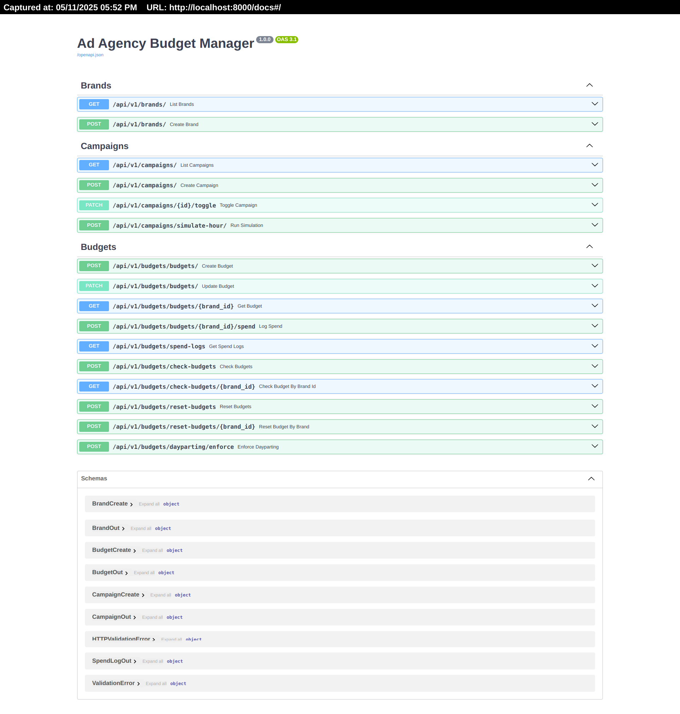

# Ad Agency Budget Manager API

This project is a budget management system for an Ad Agency. It handles:
- Daily and Monthly budget tracking
- Campaign state changes based on budget status
- Dayparting for campaigns (active during specific hours)
- Automatic reset of budgets daily/monthly
- FastAPI auto-generated docs

---

## 🔧 Tech Stack

- Python 3.10+
- FastAPI
- SQLAlchemy
- Alembic (DB migrations)
- SQLite (default DB, easily swappable)
- celery (background task scheduler)
---

## 🗂 Project Structure

```bash
├── alembic
│   ├── env.py
│   ├── .gitignore
│   ├── README
│   ├── script.py.mako
│   └── versions
│       ├── 16cf3ec810e2_initial_schema.py
│       ├── c0ba0d9951b4_change_spendlog_date_and_campaing_to_.py
│       └── ff9005086f5b_change_spendlog_date_to_datetime.py
├── alembic.ini
├── app
│   ├── api
│   │   ├── __init__.py
│   │   └── v1
│   │       ├── brand.py
│   │       ├── budget.py
│   │       └── campaign.py
│   ├── celery_worker.py
│   ├── core
│   │   ├── config.py
│   │   └── __init__.py
│   ├── db
│   │   ├── base.py
│   │   ├── __init__.py
│   │   └── session.py
│   ├── __init__.py
│   ├── models
│   │   ├── brand.py
│   │   ├── budget.py
│   │   ├── campaign.py
│   │   ├── __init__.py
│   │   └── spend_log.py
│   ├── schemas
│   │   ├── brand.py
│   │   ├── budget.py
│   │   ├── campaign.py
│   │   ├── __init__.py
│   │   └── spend_log.py
│   ├── services
│   │   ├── budget.py
│   │   └── __init__.py
│   └── task
│       ├── campaign_task.py
│       ├── __init__.py
│       └── reset_campaigns.py
├── .env
├── .env_example
├── .gitignore
├── .idea
│   ├── add_agency_project.iml
│   ├── .gitignore
│   ├── inspectionProfiles
│   │   └── profiles_settings.xml
│   ├── misc.xml
│   ├── modules.xml
│   ├── vcs.xml
│   └── workspace.xml
├── LICENSE
├── main.py
├── README.md
└── requirements.txt

```
## 🚀 Running the Project
### 1. 📦 Install Dependencies

```bash
python -m venv env
source env/bin/activate  # On Windows: env\Scripts\activate
pip install -r requirements.txt
```

##  🗃️ Set Up DB & Run Migrations
```bash
alembic revision --autogenerate -m "Recreate initial migration"
alembic upgrade head
```
## ▶️ Start FastAPI App
```bash
uvicorn main:app --reload

```
## 📄 Open API Docs
Swagger UI: http://localhost:8000/docs

Redoc: http://localhost:8000/redoc

## celery commands Background task worker:
```
celery -A app.celery_worker worker --loglevel=info -Q default
celery -A app.celery_worker beat --loglevel=info   
```
## ✅ Alembic Commands
Initialize (already done in setup):
```commandline
alembic init alembic // Initialize (already done in setup):
alembic revision --autogenerate -m "your message" // Create a new migration:
alembic upgrade head // Run migrations:
alembic downgrade -1 // Downgrade last migration:

```
## ✍️ Author Notes
Adheres to SOLID principles via service layers, clear routing, and decoupled logic.

Uses API versioning in the routing layer for scalable design.

